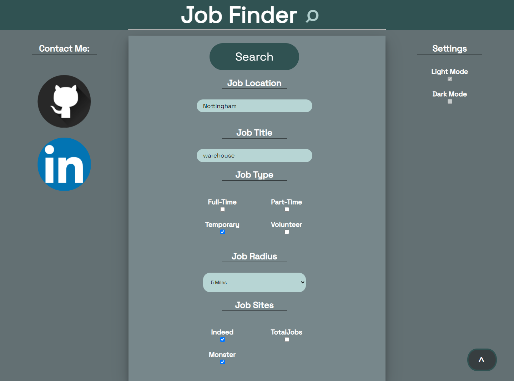
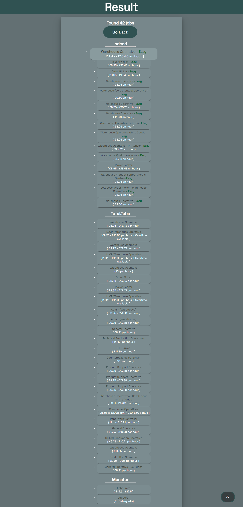

# Job finder tool 

## Overview

This project is an excuse for me to learn the selenium for python module and the django framework, therefore it is slow by design as it's not for example using the indeed API which would be quicker.
The goal of this project is not for a fast site.

This project is a local website made using the django framework alongside some static html, css, and javascript in order to have a nice interface for running a selenium script.
The website is designed to take user details once, and find theoretically all available jobs instead of typing the same details in all different job sites.

The core of this project is very basic, the user inputs their details into a html form which then calls the selenium script, returns the search results and creates a new html page based of that, that's it. I used django to connect the two and django's inheritance features to make this simpler and more scalable in the future if I decide to do more with this project.
### Main goal:

- A local website that has links to appropriate jobs held on online job boards

## Before you try

- Ensure chromedriver.exe is added to PATH, this can be found in assets/chromedriver.exe
- Ensure python is added to PATH
- Requires the following modules (use pip install):
    - Django
    - Selenium

## Instructions
1. navigate to the repo
2. navigate to the inner job-finder directory
3. in a terminal type 'python manage.py runserver' this will run on port 8080 (you can change port number by adding the number at the end like 'python manage.py runserver 4040' if thats a real port)
4. copy given url (usually http://127.0.0.1:8000/)

If you completed all the steps then you will be able to run the website.

### Screenshots:
Home page:

Result page:

### Whats New in Version 2?
Version 2 of the job finder app now implements an sqlite3 database that caches previous user searches in order for almost instant load times from previous searches.

The new database is also configured to remove old listings with every new search as keeping inactive ones is useless and keeping active ones wont result in a quicker search as the selenium script still has to search every listing.

Searching through the new database is just as detailed as previous searches the user can select the title, and job type of a listing.

The user can decide if they want the latest searches which will be slower but contain the latest job listings.

The job listing search will remain active for 30 minutes allowing for bookmarking and coming back to later, something that wasn't available in version 1.

### Future possibilities:

- show hourly rate
- default to not showing previously applied jobs
- label for each link for how easy it is to apply i.e.
    - 1 = very simple, has "apply now" button
    - 2 = must apply on company website
    - 3 = call company
- automate the application for the jobs found
