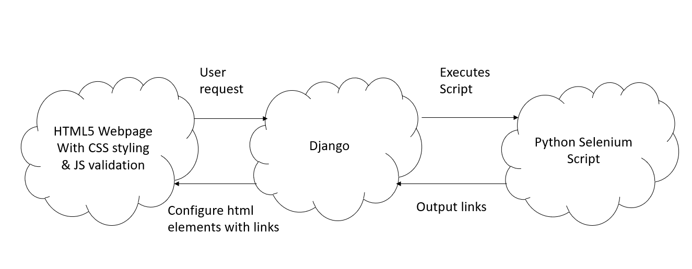
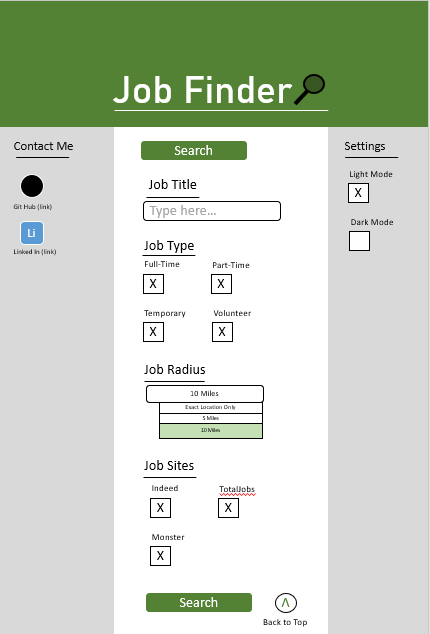
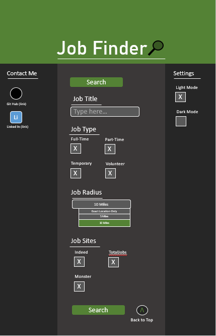

# Documentation
## Plan
- Build web scraping script in Python using selenium only with indeed
- Research other job board websites that allow for web scraping
- Implement other allowed job board websites
- Research Django
- Create front end interface
- Connect front end and selenium script

## Requirements
### User stories
priority: 1(most important) - 5 (least important)

|ID|User Story|Priority|
|--|----------|--------|
|1|As a user I want to get job links back as I want to use this app| 1|
|2|As a user I want to set the location of search as I only want relevant job links| 1|
|3|As a user without a car I want to set the distance for my work as I cannot easily drive to remote places| 2|
|4|As a student I want to filter the job type as I can't work full time| 2|
|5| As a user I want to filter out old jobs as I have likely already seen them| 4|
|6| As a user I only want to see similar job titles as I'm only interested in that work| 4|

## Specifications

Naming Convention: userstoryID.incrementor
|ID|Name|Spec|
|--|----|----|
|1|1.1|Selenium script that scrapes links to job posts from job boards|
|2|1.2|Readable output for user to make use of script|
|3|1.3|Interface for user with adequate UX|
|4|2.1|Store user location input and use that in scrape search|
|5|3.1|Apply users preferred distance to scrape search|
|6|4.1|Scrape search appropriate job types|
|7|5.1|Take input for allowed job post age|
|8|5.2|Check for job post date and only scrape ones that are younger than user input|
|9|6.1|Clean user input for job title|
|10|6.2|Validate the user input for title|
|11|6.3|Apply user input to job boards search bar, scrape results|

## System Design
A simple overview of how the complete system should work.

The system will be using a Django + Python Selenium back-end, this will consist of a web scraping tool developed using the selenium library and Django to communicate between the front and back end.
The front end of the system will be developed in HTML, making use of CSS for any styling and JavaScript for the data cleaning and validation.

Data validation will be done in the website through JavaScript as well as in the back-end in django before being processed by the selenium script.

## Prototype
A light mode and dark mode prototype for the front end design

### Light Mode:

### Dark Mode:

